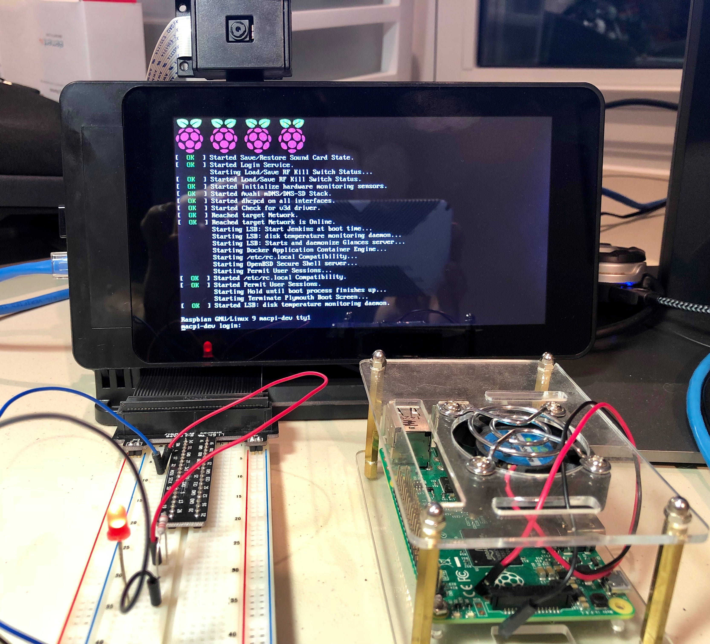

# pi4jdemo

A simple Pi4J demonstrator using Spring Boot and Docker.

## Glamor Shot

## Getting Started

This project is for Java developers who'd like to stretch out a bit and play
with "physical computing" on an inexpensive Raspberry Pi with many of the same
tools they already know.  It's a great way to build experience with Spring Boot
and app containerization with Docker, again building upon a stable knowledge
platform a step at a time.

I recommend coming with a couple years of experience working with Java and Spring
and some Linux commandline skills.  It's also helpful to know what Docker is,
what Jenkins is, and how to get a Raspberry Pi running and connected to your network.

Note that because the Raspberry Pi isn't super fast or have a ton of memory, we
stick with building just a console application with a small footprint. However,
you can quickly work up to creating rich Spring Boot Web applications in an
embedded Tomcat servers, Actuator, Thymeleaf and much more that'll nicely run
on the Pi - just keep in mind that you may need to run it stand-alone without Docker
to make startup times more bearable - it's not uncommon to wait 5 minutes for
a Spring Boot Web app to build, deploy and start as a container.

### Prerequisites

You'll need a Raspberry Pi (3+ preferred) with GPIO and SSH enabled, some circuitry
to play with, Java 8, Maven, Docker and I also recommend Jenkins and Portainer.
An Internet connection is pretty much mandatory to install those packages
and the first time you launch your app to allow Maven to fetch its dependencies
into the Pi's local Maven repo.

### Installing

Detailed instructions can be found in [this Powerpoint presentation](https://github.com/rudderfeet/pi4jdemo/blob/master/Columbus%20Code%20Camp%20-%20Java%20on%20the%20Raspberry%20Pi%20-%202018-10-27.pptx)
meant to go along with a public talk/lunch-and-learn.  Bascially we set up the Pi,
install Java, Maven, Docker, Jenkins and several plugins, then we create a build job
that either pulls this project or your extension.  On the development PC side, you'll
want your favorite IDE/editor, a Git client and Java and Maven installed.  Docker on
the dev PC can also be helpful for testing image construction, but is not absolutely necessary.

## Deployment

This is a Maven Spring Boot project at heart, so that means you can:

* Build the app and run unit tests with "mvn clean package"
* Run the application with "mvn spring-boot:run"

We've also mixed in Spotify's Docker Maven plugin, so you can:

* Create the Docker image with "mvn dockerfile:build -DskipTests=true"

## Built With

* [Maven](https://maven.apache.org/) - Dependency Management
* [Spring Boot](http://spring.io/projects/spring-boot) - IoC Framework
* [Docker](https://www.docker.com/) - Container manager

## Contributing

Feel free to email scott@mccrory.us with any corrections, bugs or to make improvements!

## Versioning

I use GitHub for version control, located at https://github.com/rudderfeet/pi4jdemo.

## Authors

* **Scott McCrory** - *Initial work* - scott@mccrory.us

## License

This project is licensed under the Apache License Version 2.0, January 2004.
Please see LICENSE for details - basically, enjoy and extend without many limits.

## Acknowledgments

Sincere thanks to all the incredible engineers and hobbyists who've been pushing the envelope
to create freely available, quality software throughout the decades.  Without their work on
Linux and it's huge ecosystem of enabling software, and that of Java, Maven and Spring, and
of course the Raspberry Pi itself...!... such a lowly developer like me would have a much less
enjoyable world to play in.
